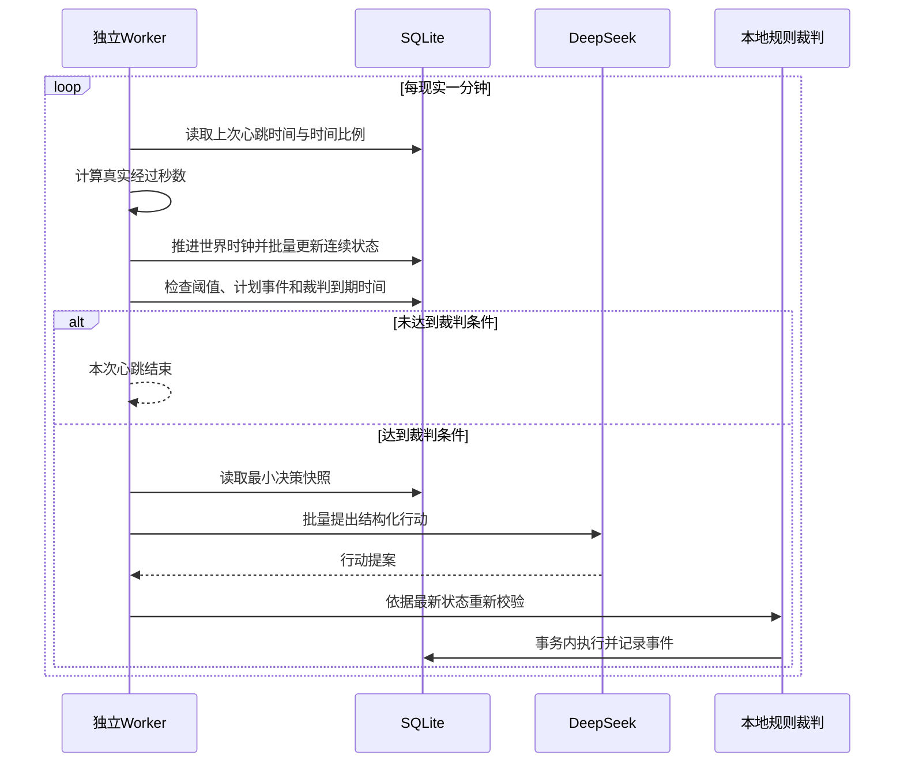

# 世界运行、时间比例与模型裁判

状态：核心方向已确认，尚未实现新的分钟心跳架构。

## 目标

把“世界时间和基础状态更新”与“模型裁判”拆开：

- 每现实一分钟执行一次轻量、确定性的状态心跳。
- 每次心跳都按照当前时间比例推进世界时间。
- 心跳只更新饱食度、精力、健康、旅途剩余时间等连续数据。
- 模型只在累计经过指定世界时间或出现重要触发事件时调用。

当前代码仍把时间推进和模型行动放在同一个 `tick()` 中。本文件描述目标架构，不代表当前代码已经完成迁移。

## 两级运行循环



## 时间比例定义

统一使用：

```text
world_minutes_per_real_minute
```

含义是“每现实一分钟等于多少世界分钟”。

| 数值 | 效果 |
|---:|---|
| 0 | 世界暂停 |
| 1 | 现实1分钟等于世界1分钟 |
| 10 | 现实1分钟等于世界10分钟 |
| 60 | 现实1分钟等于世界1小时 |
| 360 | 现实1分钟等于世界6小时 |
| 1440 | 现实1分钟等于世界1天 |

时间比例应保存在世界数据库中，通过管理API或未来表现层运行时修改。每次修改都生成一条客观事件，记录旧值、新值、操作者和生效世界时间。

## 按真实时间差推进

不能假定worker每次恰好相隔60秒。必须保存 `last_heartbeat_real_time`，并按实际时间差计算：

```text
world_delta_minutes =
    real_elapsed_seconds / 60
    * world_minutes_per_real_minute
```

例如时间比例为60，但实际经过75秒：

```text
75 / 60 * 60 = 75个世界分钟
```

建议内部使用整数世界秒或高精度定点数，避免浮点数长期累计误差。

## 离线补算

服务器重启后可以出现很大的现实时间差。设计支持三种策略：

| 策略 | 行为 |
|---|---|
| 冻结 | 离线期间世界不前进 |
| 完整补算 | 按全部离线时间推进 |
| 限制补算 | 最多补算指定世界时间 |

第一阶段推荐“限制补算”，默认上限24个世界小时。这样既保留离线演化，也避免一次重启跨过数月并触发大量模型调用。

## 连续状态变化

所有变化速率都以“每世界小时”为单位，而不是“每次心跳”为单位：

```text
state_delta = rate_per_world_hour * world_delta_hours
```

示例：

| 状态 | 自然变化示例 |
|---|---:|
| 饱食度 | 每世界小时下降4 |
| 精力 | 每世界小时下降2 |
| 睡眠精力 | 每世界小时恢复12 |
| 工作精力 | 在自然下降之外额外下降5 |

状态必须限制在明确范围内，例如0至100。状态速率会受到特质、疾病、活动、环境和物品影响。

## 模型裁判时间

每个世界保存：

```text
next_adjudication_world_time
```

心跳后检查当前世界时间是否达到该值。建议第一版固定周期为每6个世界小时一次，同时允许重要事件提前触发。

### 周期触发

适合处理：

- 人物是否改变长期计划。
- 是否主动寻找某人。
- 是否更换工作、迁居或加入组织。
- 人际关系是否发生质变。

### 事件触发

适合处理：

- 饱食度或健康进入危险阈值。
- 敌对人物相遇。
- 旅程到达目的地。
- 约会、任务或政治会议到期。
- 重要人物死亡、财产被盗或玩家主动交互。

## 高时间比例的调用上限

如果一次心跳跨过多个裁判周期，不能逐个补调用模型。规定：

- 每个世界每次心跳最多进行一次批量模型调用。
- 被跨过的多个裁判周期压缩成一个时间窗口总结。
- 提示词提供期间确定性状态变化与重要事件，不提供逐分钟噪声。

例如一次跨过24个世界小时，模型只收到一次“过去24小时总结”，而不是被调用4次。

## 并发和版本

分钟心跳会频繁改变连续状态，不能继续让任何状态变化都使整轮模型决策失效。目标设计将版本拆分为：

- `clock_revision`：世界时钟和连续状态心跳。
- `narrative_revision`：人物行动和重要事件。
- `character_revision`：单个人物的可执行状态。

模型返回后只重新验证受影响人物和目标实体。普通饱食度变化不应导致其他人物的全部决策作废。

第一阶段仍由一个独立worker串行协调心跳与裁判，避免在2GB服务器上引入复杂任务队列。

## 日志边界

分钟心跳写入技术状态日志，例如 `state_updates.jsonl`；世界编年史只记录：

- 时间比例变化。
- 关键阈值跨越。
- 模型裁判。
- 人物行动与重大后果。

普通的每分钟数值变化不会淹没 `history.md`。

