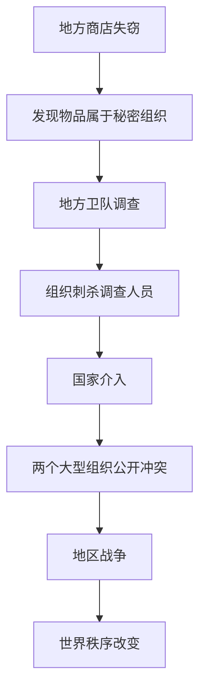

# 事件分级、因果链与历史记录

状态（2026-09-11）：基础事件档案、本地因果连接和分层派生日志已接入，见[实施记录19](19-lived-experience-evidence-and-growth.md)。范围、影响和状态保存在兼容旧存档的 event_profiles 中；世界/地区事件的因果升级与频率门禁仍未完整实现。

## 核心结论

事件不能只用一个“等级”表示。至少分开记录：

- 发生范围：事件发生在哪里、直接涉及哪些实体。
- 影响强度：事件可能改变多大范围的秩序。

例如“国王在一间小屋中遇刺”发生范围很小，但影响可能是世界级。

## 事件范围

| 范围 | 标识 | 示例 | 典型频率 |
|---|---|---|---|
| 世界级 | `global` | 外敌入侵、全球灾害、巨型组织全面战争 | 极少 |
| 地区级 | `regional` | 国家政变、地区战争、大型组织分裂 | 较少 |
| 地方级 | `local` | 镇长选举、盗窃、地方疫情、商会纠纷 | 常见 |
| 人际级 | `interpersonal` | 交易、争吵、约会、私人背叛 | 很常见 |

世界级事件必须经过严格门禁：有长期原因、有地区事件积累、有影响对象、有冷却时间，并能落地到真实状态后果。模型不能凭空生成“世界毁灭”来制造戏剧性。

## 影响强度

独立使用1至5级：

| 等级 | 含义 |
|---:|---|
| 1 | 只影响少数人物，容易恢复 |
| 2 | 对一个家庭、店铺或小团体产生持续影响 |
| 3 | 改变一个地方或组织的正常运行 |
| 4 | 改变国家、地区或大型组织关系 |
| 5 | 可能重塑整个世界秩序 |

普通商店失窃可以是 `local + 2`；世界级武器核心被盗可以是 `local + 5`。

## 事件结构

目标事件至少包含：

```json
{
  "event_id": "event_001",
  "event_type": "theft",
  "scope_type": "local",
  "scope_id": "town_01",
  "impact_level": 2,
  "status": "confirmed",
  "parent_event_id": null,
  "cause_event_ids": [],
  "affected_entity_ids": [],
  "world_time": "2040-04-01T18:00:00Z",
  "visibility": "witnesses_only"
}
```

推荐生命周期：

- `rumored`：只作为传闻存在。
- `suspected`：有人怀疑，但未确认。
- `confirmed`：客观事实已经确认。
- `ongoing`：仍在发生。
- `resolved`：主要冲突已经结束。
- `archived`：长期历史记录。

## 因果升级

高级事件应由低级事件逐步演化：



每一级都创建新的事件，并通过 `parent_event_id` 和 `cause_event_ids` 连接，不能直接修改旧事件来伪造历史。

## 世界事件与人物状态分离

### 世界事件回答

```text
发生了什么？
谁参与了？
在哪里发生？
造成了哪些客观后果？
```

### 人物状态更新回答

```text
人物的数值发生了什么变化？
变化前后是多少？
变化由哪个心跳或事件造成？
```

示例：

世界事件：

```text
林澈在晨星广场购买并吃掉了一份面包。
```

状态更新：

```json
{
  "character_id": "npc_lin",
  "source_event_id": "event_eat_001",
  "changes": {
    "satiety": {"before": 25, "after": 72},
    "money": {"before": 9, "after": 6}
  }
}
```

人物主观记忆则记录“林澈如何理解这件事”，可能与客观事实不完全一致。

## 状态何时升级为世界事件

普通连续变化只写个人状态日志。跨越关键阈值时生成世界事件或人物事件，例如：

- 饱食度低于20：严重饥饿。
- 健康低于30：生命危险。
- 金钱归零：失去支付能力。
- 旅途完成：到达新地点。
- 关系值跨过敌对或信任阈值。

阈值事件可以触发模型提前裁判。

## 日志目录目标

```text
logs/worlds/<world_id>/
├── global/
│   └── history.md
├── regions/
│   └── <region_id>/history.md
├── locations/
│   └── <location_id>/history.md
├── interpersonal/
│   └── events.jsonl
├── state_updates.jsonl
└── ticks/
```

统一的 `history.md`、`history.jsonl` 与 `ticks/` 保留；现已按已记录范围导出子目录和 scope_manifest。目录标识经过散列，当前事件主要是人际/地方范围，不表示已经模拟地区战争或世界级升级。

## 信息传播

客观事件发生后，不是所有人物立即知道：

1. 参与者和现场目击者直接获得事件片段。
2. 地方事件可以通过交谈、公告和组织网络传播。
3. 地区与世界事件可以通过官方消息、商路和传闻传播。
4. 每次传播都可能丢失细节或发生扭曲。
5. 人物知识图保存信息来源、可信度和最后验证时间。

## 模型裁判等级

| 事件范围 | 推荐处理 |
|---|---|
| 人际级 | 规则或普通批量模型调用 |
| 地方级 | 结合地点状态和关键人物裁判 |
| 地区级 | 读取组织、资源和多地后果后裁判 |
| 世界级 | 两阶段评估，先验证因果条件，再生成有限行动 |

世界级事件必须由程序门禁控制频率，不能只依赖提示词要求模型“少生成”。
