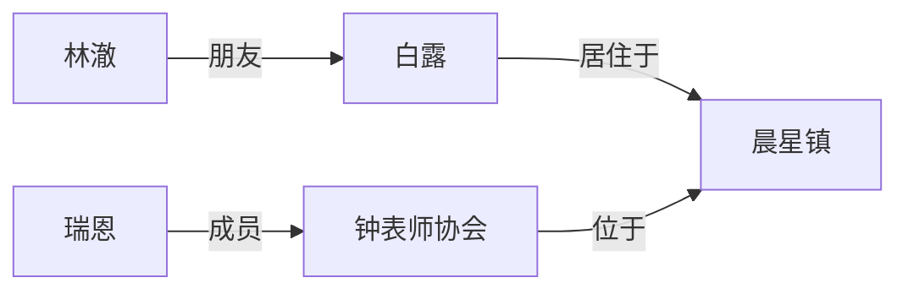
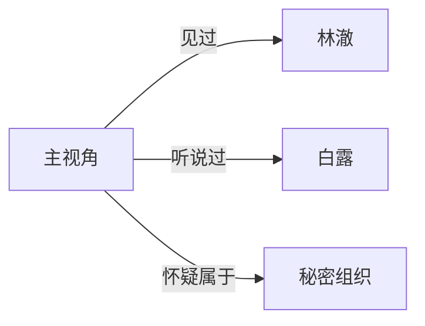
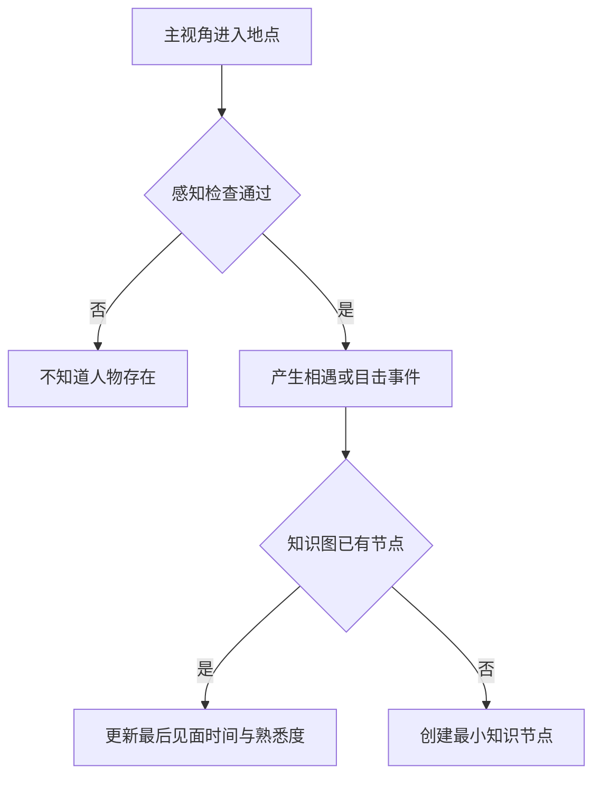

# 人物结构、特质状态与主观知识图

状态：人物数据分层与双图设计已确认，尚未实施数据库迁移。

## 人物结构

```text
人物
├── 身份 Identity
├── 特质 Traits
├── 当前状态 State
├── 背包 Inventory
├── 社会关系 Relations
├── 主观知识 Knowledge
└── 记忆 Memories
```

### 身份

相对固定的信息：姓名、年龄、出生地、职业、外貌、所属国家和组织。

### 特质

长期稳定的行为倾向：谨慎、善良、贪婪、固执、勇敢、多疑、节俭、冲动。

特质与当前状态必须分开：

- “谨慎”是特质。
- “现在害怕”是状态。
- 谨慎特质会影响人物进入害怕状态的概率和行动选择。

特质建议保存强度和来源：

```json
{
  "trait": "afraid_of_fire",
  "intensity": 65,
  "origin_type": "acquired",
  "origin_event_id": "event_house_fire_01"
}
```

重大事件可以缓慢增加、减弱或新增特质，但普通心跳不能直接改变人格。

### 当前状态

频繁变化的数据：饱食度、精力、健康、情绪、压力、位置、当前行动、疾病、伤势和中毒。

状态变化写入 `character_state_updates`，当前值保存在人物状态表中。日志优先保存差值，定期再保存完整快照。

## 特质、状态、环境与物品共同决策

```text
长期特质决定倾向
+ 当前状态产生压力
+ 环境提供机会
+ 背包提供手段
= 人物可选择的行动
```

例如“节俭 + 严重饥饿 + 背包中最后一块面包”会形成真实取舍，而不是模型凭空拿出食物。

## 两张关系图

### 客观世界图

系统掌握的真实实体与关系：



客观图包含隐藏人物、真实组织身份、真实亲属关系和秘密，但表现层不能直接展示全部内容。

### 观察者知识图

每个主视角或可独立认知的人物拥有自己的知识图：



主观图可以不完整、过期或错误。边必须保存来源、可信度、首次获知时间和最后验证时间。

## 新人物发现

人物不是在主视角遇见时才被创建。他早已存在于客观世界；相遇只把他加入主视角知识图。



初次见面只保存可观察信息：

```json
{
  "entity_id": "npc_27",
  "known_name": "陌生的黑衣女子",
  "knowledge_status": "seen",
  "first_seen_at": "2040-04-02T09:00:00Z",
  "familiarity": 1,
  "confidence": 1.0,
  "known_attributes": {
    "appearance": "黑色长衣",
    "location": "晨星镇酒馆"
  }
}
```

如果对方自称“艾琳”，只能记录“自称姓名”，不能立即覆盖客观真实身份。

## 认知阶段

| 状态 | 含义 |
|---|---|
| `rumored` | 只从传闻中听说过 |
| `seen` | 看见过，但未交流 |
| `encountered` | 正式接触过 |
| `acquainted` | 互相认识 |
| `familiar` | 比较熟悉 |
| `trusted` | 主视角信任对方 |
| `verified` | 关键身份已经验证 |

“听说过”和“见过”都可以产生节点，但来源和可信度不同。

## 知识边证据

```json
{
  "observer_id": "player_01",
  "source_entity_id": "npc_lin",
  "relation": "suspected_member_of",
  "target_entity_id": "org_secret_01",
  "confidence": 0.4,
  "learned_at": "2040-04-03T18:00:00Z",
  "source_event_id": "rumor_021",
  "last_verified_at": null
}
```

后续证据可以提升、降低或推翻这条边，但旧证据仍保留。

## 物品可见性

客观世界知道人物实际携带什么，观察者只知道自己看见、搜查、交易或听说过的物品。

例如：

```text
客观背包：匕首、密信
主视角知识：看见腰间匕首，不知道密信存在
```

知识图可以连接人物和已知物品，但不能直接复制客观背包。

## 存储建议

第一阶段在SQLite中使用普通节点表和边表：

```text
world_entities
world_relations
observer_knowledge_nodes
observer_knowledge_edges
```

不引入Neo4j。未来表现层可以使用Cytoscape或D3读取节点与边，在浏览器中绘制关系图。

