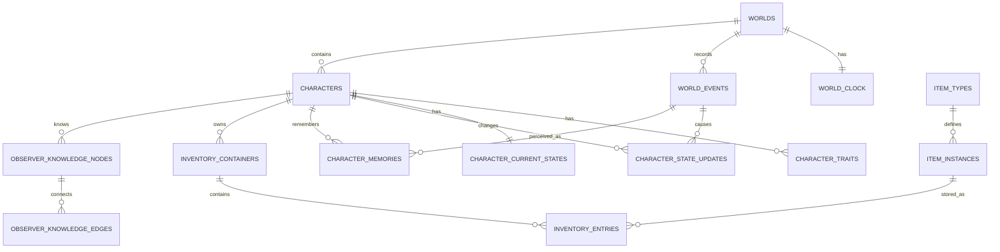

# 目标数据模型与实施路线

状态：实施建议，尚未开始迁移。

## 当前与目标边界

当前代码已经实现：

- `worlds`、`world_runtime`
- `locations`
- `characters`
- `relationships`
- `world_events`
- `character_memories`
- DeepSeek结构化行动与规则降级
- 统一世界历史日志

后续不能一次性重写全部表。应采用可回滚迁移，每个阶段先备份真实SQLite数据库、验证哈希和 `integrity_check`，再升级结构。

## 目标表分组

### 世界时钟与心跳

```text
world_clock
world_heartbeats
scheduled_world_events
adjudication_runs
```

`world_clock` 保存当前世界时间、时间比例、最后现实心跳和离线补算策略。`world_heartbeats` 保存每分钟技术更新摘要。

### 人物身份、特质与状态

```text
character_identities
character_traits
character_current_states
character_state_updates
character_state_snapshots
```

- 身份保存相对固定信息。
- 特质保存长期倾向、强度和来源事件。
- 当前状态保存最新数值。
- 状态更新保存差值和原因。
- 状态快照按世界日或重要节点保存完整状态。

### 事件与范围

```text
event_scopes
world_events
event_causes
event_affected_entities
event_visibility
```

现有 `world_events` 将增加 `scope_type`、`scope_id`、`impact_level`、`status`、`parent_event_id` 和 `visibility`。

### 客观关系图

```text
world_entities
world_relations
```

实体可以是人物、地点、国家、组织、物品或事件。关系边记录类型、有效时间和来源。

### 主观知识图

```text
observer_knowledge_nodes
observer_knowledge_edges
knowledge_evidence
encounters
```

每个观察者拥有独立的已知实体、主观关系和证据链。

### 物品与库存

```text
item_types
item_instances
inventory_containers
inventory_entries
inventory_transactions
equipment_slots
```

所有物品转移都经过 `inventory_transactions`，并可关联客观事件。

## 目标关联图



## 推荐实施顺序

### 阶段0：设计固化

本目录即本阶段产物。目标是把已确认设计与待决定参数分开，避免边讨论边重构。

### 阶段1：分钟心跳与可调时间比例

- 增加 `world_clock`。
- worker固定每现实一分钟唤醒。
- 按实际现实时间差推进。
- 连续状态与模型裁判拆开。
- 增加离线补算上限。
- 为旧 `tick()` 保留兼容入口。

验收：改变时间比例后，世界时间和人物状态按比例变化；未到裁判条件时不调用模型。

### 阶段2：个人状态日志与事件分级

- 拆出 `character_current_states` 和 `character_state_updates`。
- 为事件增加范围、影响、生命周期和因果关系。
- Markdown编年史按范围过滤。

验收：每分钟状态变化不污染世界编年史，关键阈值仍会形成可追溯事件。

### 阶段3：人物特质迁移

- 从 `traits_json` 迁移到 `character_traits`。
- 保留初始特质和后天特质来源。
- 决策器只读取与本轮相关的特质。

验收：特质不会被普通心跳修改，重大事件可以产生带来源的后天特质。

### 阶段4：小背包与物品实例

- 增加物品类型、实例、容器和交易表。
- 支持拾取、丢弃、使用、赠送、交易和存取。
- 所有权、实际持有和主视角已知物品分离。

验收：背包满时无法凭空拾取，物品转移能够追溯来源事件，模型不能使用不存在的物品。

### 阶段5：客观图与主观知识图

- 增加实体节点和关系边。
- 相遇、传闻和验证更新观察者知识图。
- 不向主视角暴露隐藏身份、关系和物品。

验收：新人物早已存在于客观世界；主视角遇见后才出现知识节点，传闻允许错误并能被后续证据推翻。

### 阶段6：表现层

在内核数据结构稳定后再选择：

- 文字对话与世界编年史。
- 网页人物面板与关系图。
- 视觉小说。
- 2D或3D游戏客户端。

表现层不能成为第二份世界状态源。

## 2核2GB服务器约束

- 继续使用SQLite WAL和单独worker。
- 不引入Neo4j、Redis或Celery。
- 每次心跳使用批量SQL更新连续状态。
- 每次心跳最多一次批量模型请求。
- 图关系先使用SQLite节点和边表。
- 日志继续作为SQLite派生视图，可随时重建。

## 迁移安全规则

每个阶段必须：

1. 备份真实数据库并计算哈希。
2. 在临时数据库演练迁移。
3. 运行旧数据兼容测试。
4. 运行SQLite `integrity_check`。
5. 验证真实日志没有丢失轮次。
6. 检查 `.env`、数据库、日志和密钥没有进入Git。
7. 使用本地Git里程碑记录可回滚状态。

## 下一次实现前建议先确认

优先确认以下三个参数即可开始阶段1：

1. 默认时间比例。
2. 固定模型裁判的世界时间间隔。
3. 服务器离线补算上限。
