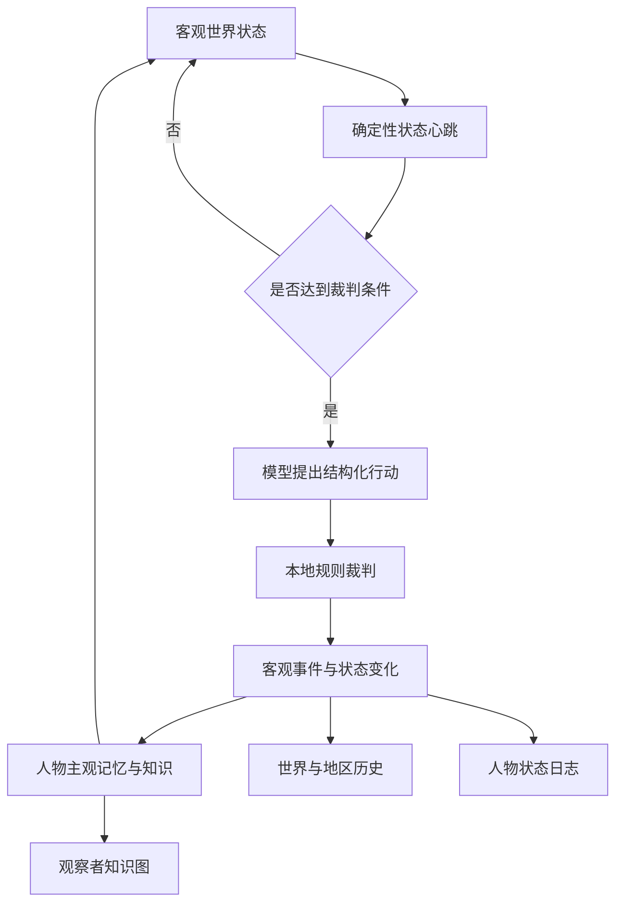

# 自主世界设计索引

设计版本：`0.1`

最后更新：2026-09-14

## 文档目的

食品批次保鲜、变质与持续不适见[记录23](23-food-freshness-and-discomfort.md)。

门口拜访、短时进入邀请及实体钥匙的当前实施见[记录22](22-door-visits-and-physical-keys.md)。

当前未完成设计、已实现但待填内容以及历史状态修正，见[完成度核对](implementation-audit-20260913.md)。

周期作息与生计选择的最新实现及验收见[实施记录20](20-recurring-routines-and-livelihood.md)。
生产准备、限额采购及工具消耗见[实施记录21](21-production-supplies-and-tools.md)。

生活经历的因果、认知证据和后天倾向见[实施记录19](19-lived-experience-evidence-and-growth.md)。

NPC 日程、见面时间窗、确认改期及内容交接见
[18-npc-schedules-and-content-handoff.md](18-npc-schedules-and-content-handoff.md)。
交给内容模型填写时使用[生活内容填写说明](../content/life-content-authoring.md)。

文字生活体验的最新实施路线与阶段验收见
[16-lived-world-roadmap.md](16-lived-world-roadmap.md)。
困难动作的概率检定评估见 [17-action-checks-proposal.md](17-action-checks-proposal.md)，
修理与地图核对检定已实现并通过本轮统一验收；开锁等扩展仍按文档边界单独实施。

本目录保存自主世界的长期设计思路，供后续实现、迁移、表现层开发和服务器部署时直接恢复上下文。

`docs/ARCHITECTURE.md` 描述当前已经运行的代码；本目录同时包含已实现设计和已确认但尚未实现的目标设计。任何人开始修改代码前，都应先检查下方决策状态，不能把目标设计描述成当前运行事实。

## 状态说明

| 状态 | 含义 |
|---|---|
| 已实现 | 已有代码、测试和运行证据 |
| 已确认待实现 | 设计方向已确认，但数据库和业务代码尚未迁移 |
| 提议 | 当前推荐方案，仍可继续讨论 |
| 待决定 | 必须由产品体验或用户选择决定 |

## 核心决策登记

| 编号 | 决策 | 状态 | 设计文档 |
|---|---|---|---|
| D001 | 世界状态、调度和记忆全部自托管；第三方只提供模型推理API | 已实现 | `docs/ARCHITECTURE.md` |
| D002 | SQLite是第一阶段唯一客观事实源 | 已实现 | `docs/ARCHITECTURE.md` |
| D003 | 模型只能提交结构化行动，本地规则拥有最终裁判权 | 已实现 | `docs/ARCHITECTURE.md` |
| D004 | 客观事件可导出为Markdown、JSONL与逐轮JSON日志 | 已实现 | `docs/ARCHITECTURE.md` |
| D005 | 每现实一分钟进行一次轻量状态心跳 | 已实现 | `01-runtime-and-time.md` |
| D006 | 世界时间比例可在运行时修改，按实际现实时间差推进 | 已实现 | `01-runtime-and-time.md` |
| D007 | 模型固定在世界时间00:00和12:00裁判，不随每次心跳调用 | 已实现 | `01-runtime-and-time.md` |
| D008 | 事件范围与影响强度分开；范围分世界、地区、地方、人际四级 | 基础档案与本地因果已实现；高级升级待补 | `02-events-and-history.md` |
| D009 | 世界事件、人物状态变化和人物主观记忆分开记录 | 已实现 | `02-events-and-history.md` |
| D010 | 人物长期特质与当前状态分开存储 | 首批知识与倾向已实现，通用设计仍待扩展 | `03-characters-and-knowledge.md` |
| D011 | 客观世界关系图与每个观察者的主观知识图分离 | 首批知识与倾向已实现，通用设计仍待扩展 | `03-characters-and-knowledge.md` |
| D012 | 普通人物拥有小背包，物品来源和所有权可追溯 | 基础实现；默认2格，完整容器与经济待扩展 | `04-items-and-inventory.md`、`14-core-completion.md` |
| D013 | 2GB服务器第一阶段继续使用SQLite节点表和边表，不引入图数据库 | 首批知识与倾向已实现，通用设计仍待扩展 | `03-characters-and-knowledge.md` |
| D014 | 人物使用0至100的正向饱食度，100最舒适 | 已实现 | `01-runtime-and-time.md` |
| D015 | 调速先按旧比例结算并原子提交；相同比例为无操作 | 已实现 | `01-runtime-and-time.md` |
| D016 | 世界长期变化通过统一注册门面、严格类型处理器和来源事件审计落库；Agent只能提交候选 | 已实现（第一阶段） | `11-world-element-registry.md` |
| D017 | 全部世界对象共享元素目录与生命周期；专有字段和规则继续保留在专用事实表 | 已实现（混合模型） | `12-world-element-lifecycle-and-capture.md` |

## 推荐阅读顺序

1. `01-runtime-and-time.md`：世界为什么会持续运行，以及何时调用模型。
2. `02-events-and-history.md`：世界历史如何分级、传播和记录。
3. `03-characters-and-knowledge.md`：人物结构、关系图和主视角认知边界。
4. `04-items-and-inventory.md`：物品实例、小背包和所有权流转。
5. `05-data-model-and-roadmap.md`：建议数据库结构、迁移顺序和验收标准。
6. `11-world-element-registry.md`：玩家/NPC造成的新人物、聚落、建筑、巨构和动态知识如何登记。
7. `12-world-element-lifecycle-and-capture.md`：元素如何退出活跃世界，以及拍照如何读取当前世界事实。

## 总体原则

设计始终遵守：

- 模型不是数据库，也不是世界事实源。
- 连续数值由确定性代码推进，模型只处理选择、解释和复杂冲突。
- 世界事实、人物状态和主观知识必须能够相互关联，但不能混为一体。
- 任何高级世界事件都必须有可追溯的原因、影响范围和后果。
- 表现层只能展示它有权知道的信息，不能泄漏客观世界中的隐藏数据。

## 已确认的状态表达

- 人物采用正向“饱食度”：`100` 表示最舒适，`0` 表示危机。
- 饱食度随世界时间下降，进食后上升；数据库和新状态日志统一使用 `satiety`。
- 迁移前的客观事件和JSONL历史保留原文，其中可能仍出现旧字段 `hunger`。

## 仍待确认的体验参数

- 普通人物默认背包容量最终选择1格还是2格。
- 哪些事件等级对主视角直接公开，哪些必须通过消息传播获得。
